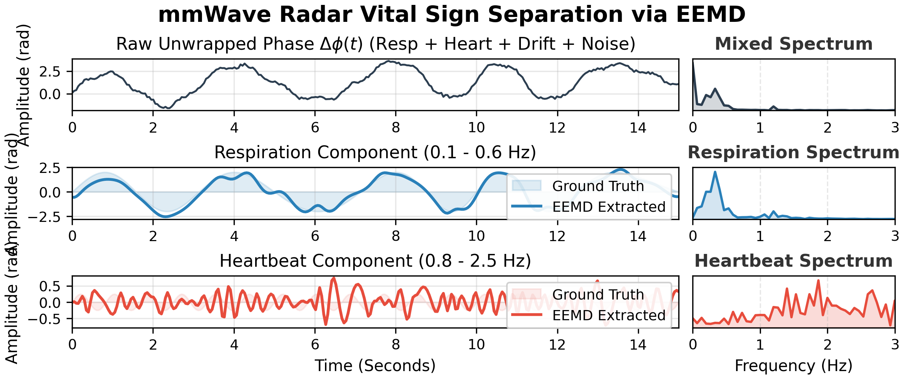
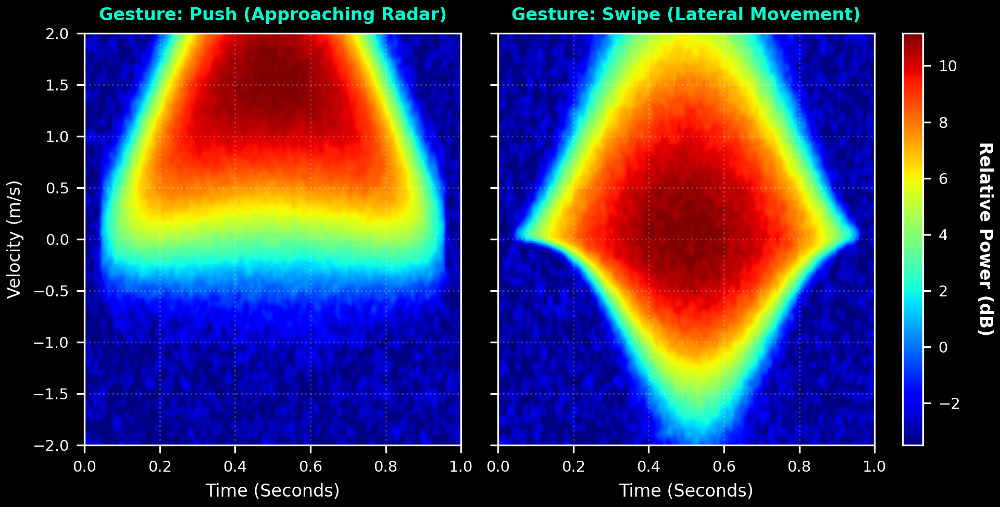

  <h1>🎨 可视化画廊 (Visual Gallery)</h1>
  
<b>Show, Don't Tell.</b>

  
本画廊直观展示了毫米波 (mmWave) 雷达感知技术在三大核心应用场景下的底层物理特征与算法处理效果。所有相关索引与开源工具均可在 <a href="README.md">主页 (README)</a> 中找到。

---

## 📍 1. 室内 3D 多目标追踪 (Multi-Person 3D Tracking)

> **技术栈:** CFAR Point Cloud $\rightarrow$ DBSCAN Clustering $\rightarrow$ 3D Bounding Box

毫米波雷达原生输出带有深度 (Z轴) 与速度特征的稀疏点云 (Sparse Point Cloud)。下图演示了基于密度聚类算法在三维空间中对多目标（如走动与徘徊）进行的实时轨迹捕捉与边界框锁定。

  
  
<i>Figure 1: Simulated mmWave sparse point cloud tracking with DBSCAN clustering.</i>

---

## 🫀 2. 生理体征解缠绕 (Vital Sign Separation)

> **技术栈:** Phase Unwrapping $\rightarrow$ EEMD (Ensemble Empirical Mode Decomposition) $\rightarrow$ FFT Analysis

这是雷达非接触式健康监测的核心难点。原始的雷达相位信号 $\Delta\phi(t)$ 通常充斥着基线漂移与环境噪声。通过 EEMD 算法，我们能够从呼吸的大波浪中，精准剥离出振幅相差近十倍的微弱心跳分量。

  
  
<i>Figure 2: Time-Frequency dual-view analysis. Robust extraction of Respiration (0.1-0.6 Hz) and Heartbeat (0.8-2.5 Hz) from mixed phase signals.</i>

---

## ✋ 3. HCI 手势交互与微多普勒 (Micro-Doppler Signatures)

> **技术栈:** Range-Doppler Heatmap $\rightarrow$ Kinematic Signature Extraction

微多普勒 (Micro-Doppler) 效应是雷达手势识别 (如 Google Project Soli) 的物理基石。不同的手部运动学轨迹会在时频图上留下独一无二的能量拖尾特征，这是后续 CNN/RNN 深度学习模型的绝佳输入。

  <table style="text-align:center; border:none;">
    <tr>
      <th width="50%">Gesture: Push (Approaching Radar)</th>
      <th width="50%">Gesture: Swipe (Lateral Movement)</th>
    </tr>
    <tr>
      <td>正向多普勒频移，能量高度集中。</td>
      <td>横向宽带展宽，包含正负径向速度分量。</td>
    </tr>
    <tr>
      <td></td>
      <td></td>
    </tr>
  </table>

  
  
<i>Figure 3: Synthetic Micro-Doppler spectrograms (Relative Power in dB) for different hand kinematics.</i>

---

  
探索更多干货与论文索引，请返回 <b><a href="README.md">awesome-mmwave-sensing</a></b>。

